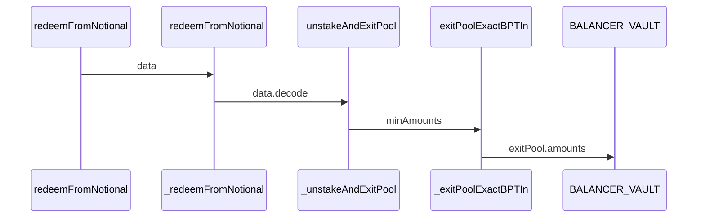

Wide Spruce Fox

medium

# Loss of judgment on withdrawal asset length and slippage length leads to redemption failure

## Summary

Loss of judgment on withdrawal asset length and slippage length leads to redemption failure

## Vulnerability Detail

In the redemption of BalancerComposableAuraVault and BalancerWeightedAuraVault, the parameter transfer path for slippage judgment is:


In this process, it is never judged whether the length of minAmountsde is the same as the length of assets. In the BALANCER_VAULT [code](https://arbiscan.io/address/0xBA12222222228d8Ba445958a75a0704d566BF2C8#code#F30#L118) and the [document](https://docs.balancer.fi/reference/joins-and-exits/pool-exits.html#token-ordering), it is clearly required that the length of the slippage array needs to be the same as the length of the redeemed assets.


When depositing assets, there is a clear judgment. This may be due to the negligence of the developer.


## Impact

Loss of judgment on withdrawal asset length and slippage length leads to redemption failure

## Code Snippet
https://github.com/sherlock-audit/2023-10-notional/blob/7aadd254da5f645a7e1b718e7f9128f845e10f02/leveraged-vaults/contracts/vaults/balancer/mixins/BalancerPoolMixin.sol#L188-L198
## Tool used

Manual Review

## Recommendation

Add 
```solidity
require(assets.length == amounts.length);
```
 judgment before requesting, and ensure the order is consistent
